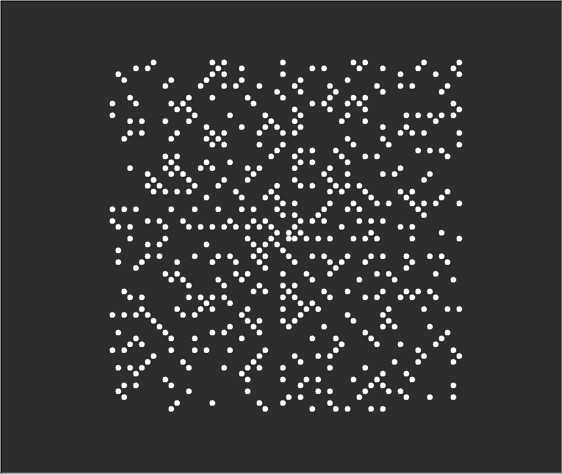
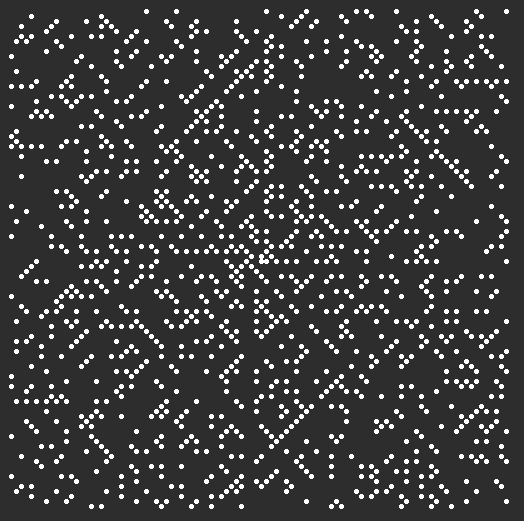
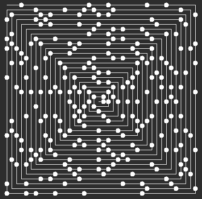

# prime-spiral
Prime spiral (also known as Ulam's spiral) implemented in Python using `turtle`

Saw [this video](https://www.youtube.com/watch?v=a35KWEjRvc0) by The Coding Train and thought it looked cool, and reasonable to implement myself.

## Examples:

Prime spiral with max value 3600 without path lines, and dot radius 10

Prime spiral with max value 10,000 without path lines, and dot radius 5

Prime spiral with max value 4000 with path lines, and dot radius 10
